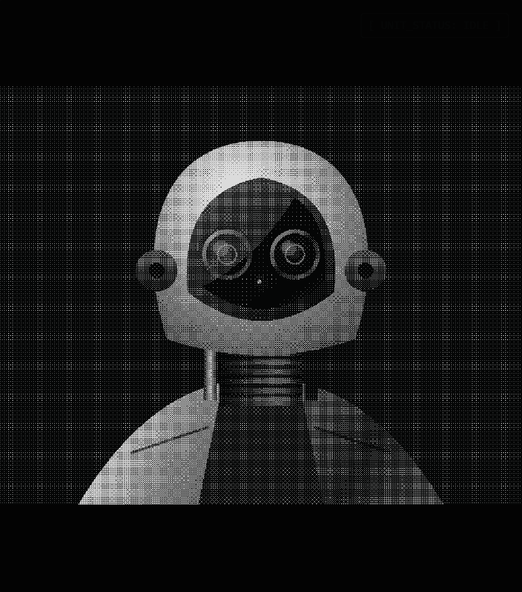

<pre>
     ██  █████   ██████ ██   ██ ██ ███████     ███████ ██   ██  █████   ██████  
     ██ ██   ██ ██      ██  ██  ██ ██          ██      ██   ██ ██   ██ ██    ██ 
     ██ ███████ ██      █████   ██ █████       ███████ ███████ ███████ ██    ██ 
██   ██ ██   ██ ██      ██  ██  ██ ██               ██ ██   ██ ██   ██ ██    ██ 
 █████  ██   ██  ██████ ██   ██ ██ ███████     ███████ ██   ██ ██   ██  ██████  
                                                                                                                                                 
Waterloo MechE Student // ex. OPmobility, Chart Industries
</pre>

     

  

  
  
</a>
 

| Project | Stack | Access |
| :--- | :--- | :--- |
| **###** |   | [**[ REPO ]**](https://github.com/yourusername/project-1) |
| **###** |   | [**[ REPO ]**](https://github.com/yourusername/project-2) |
| **###** |   | [**[ REPO ]**](https://github.com/yourusername/project-3) |
| **###** |   | [**[ REPO ]**](https://github.com/yourusername/project-4) |

 

